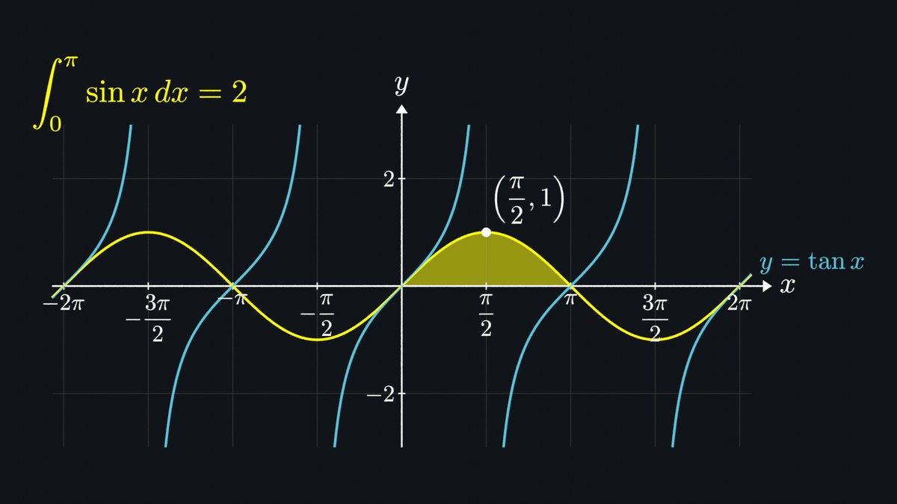
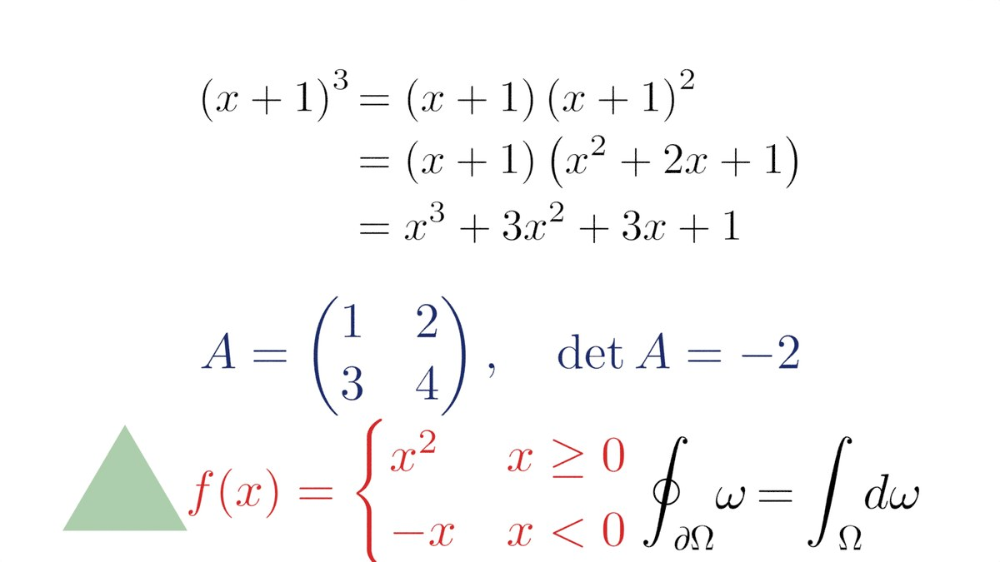
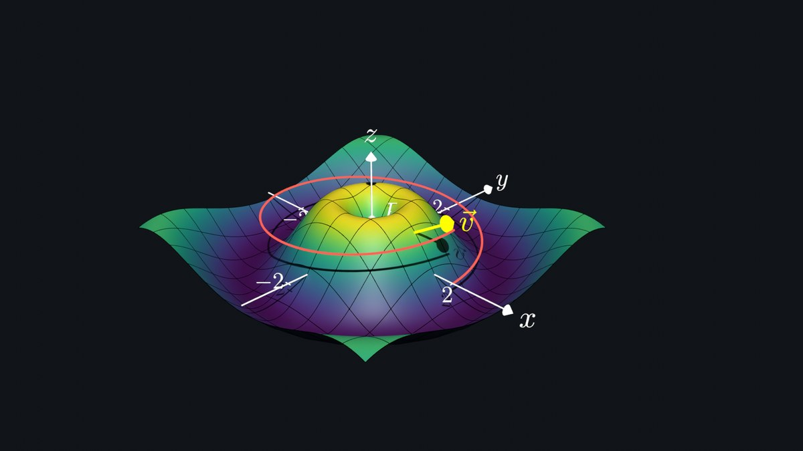

# Blender Math MCP

An [MCP](https://modelcontextprotocol.io) server plus Blender add-on that lets an AI put **mathematically correct** content on screen in Blender:

- real LaTeX typesetting (the font outlines themselves, as filled curves)
- graphs computed from the formula itself, with poles, jumps and gaps handled correctly
- symbolic checking of every equation before it is shown



| Typesetting (LaTeX / amsmath, verified derivations) | 3D surfaces, curves and vectors |
|---|---|
|  |  |

## Why output is correct, not just approximately right

| Problem | What the plugin does |
|---|---|
| AI-written LaTeX can be wrong | `render_expression`, `compute` and `render_derivation` generate LaTeX **from parsed SymPy math**, so the formula shown is the formula computed. `verify_math` proves identities (or returns a counterexample). |
| False steps in derivations | `render_derivation` checks every `=` and **draws nothing** if a step is false. |
| Formulas drawn as approximations | Formulas are typeset by real **LaTeX** (or matplotlib's TeX engine as a fallback) and imported as the exact Bezier font outlines. Matrix spacing, fraction bars and limits match what LaTeX produces. |
| `tan x` drawn with vertical lines through its poles, `floor x` as a staircase | Adaptive sampling **detects discontinuities** and breaks the curve at them. Undefined regions (e.g. `sqrt(x)` for x < 0) are left empty. |
| Curves cut off at a sample point near the window edge | Clipping finds the **exact crossing** by bisection on the real function (e.g. `tan x` exits at exactly `atan 3`). Steep curves that cross the window between two samples are still found. |
| Jagged curves | Curves are refined where they bend until the drawn polyline stays within a tolerance of the true curve (tied to line thickness). |
| Implicit curves (`x^2 + y^2 = 4`) come out approximate | Contour points are snapped onto the curve with Newton steps (error ~1e-12). False "curves" at poles are removed. |
| Colors look washed out | `setup_scene` sets Blender's *Standard* view transform and uses unlit (emission) materials, so `#58C4DD` shows as exactly `#58C4DD`. |
| Distorted graphs | Axes default to an equal aspect ratio (circles stay circles). Arrow tips land exactly on their end point. |

## How it works

```
AI client ──MCP (stdio)──▶ blender-math-mcp (Python)        ──TCP 127.0.0.1:9877──▶ Blender add-on
                           • SymPy parsing / verification                          • builds curves, meshes,
                           • LaTeX → glyph outlines                                   materials, camera
                           • adaptive sampling / clipping                           • renders previews
```

The heavy work (SymPy, LaTeX, NumPy, matplotlib) runs in the MCP server. The Blender add-on is a single dependency-free file that only receives ready-made geometry, so it works with any Blender Python.

## Installation

### 1. MCP server

Python ≥ 3.10:

```bash
pip install git+https://github.com/GTKottman/Blender-Math
# or from a clone:  pip install -e .
```

The command is `blender-math-mcp`. You can also run it with no install: `uvx --from git+https://github.com/GTKottman/Blender-Math blender-math-mcp`.

**Optional, recommended: install LaTeX** for full LaTeX support (matrices, `aligned`, `cases`, `\text`, amsmath/amssymb/bm). Install TeX Live, MiKTeX or MacTeX so that `latex` and `kpsewhich` are on your `PATH`. On Debian/Ubuntu:

```bash
sudo apt install texlive-latex-base texlive-latex-extra texlive-fonts-recommended cm-super
```

Without LaTeX, the plugin falls back to matplotlib's *mathtext* engine. It uses the same Computer Modern fonts and covers most formulas, but not environments. Check which one is active with the `blender_status` tool.

### 2. Blender add-on (Blender 3.6+ / 4.x)

```bash
python scripts/build_addon.py      # -> dist/blender_math_bridge.zip
```

In Blender: *Edit → Preferences → Add-ons → Install from Disk…* → choose the zip → enable **Blender Math Bridge (MCP)**. Then in the 3D View press **N** → **Math MCP** tab → **Start Math MCP server**. You can also enable auto-start in the add-on preferences.

### 3. Connect your AI client

**Claude Code**

```bash
claude mcp add blender-math -- blender-math-mcp
```

**Claude Desktop** (`claude_desktop_config.json`):

```json
{
  "mcpServers": {
    "blender-math": { "command": "blender-math-mcp" }
  }
}
```

(Or `"command": "uvx", "args": ["--from", "git+https://github.com/GTKottman/Blender-Math", "blender-math-mcp"]`.)

Environment variables: `BLENDER_MATH_HOST`, `BLENDER_MATH_PORT` (default `127.0.0.1:9877`), `BLENDER_MATH_BACKEND` (`auto` | `latex` | `mathtext`).

To check the setup without an AI, run `python examples/showcase.py` while Blender's server is running.

## Tools

| Tool | Purpose |
|---|---|
| `blender_status` | Connection check and active typesetting backend |
| **Math (no Blender needed)** | |
| `verify_math(lhs, rhs)` | Proves an identity symbolically, or checks it numerically at random points; returns a counterexample when false |
| `compute(operation, expression, …)` | simplify / expand / factor / diff / integrate / limit / series / solve / sum / evalf, with LaTeX of `input = result` |
| `expression_to_latex` | SymPy syntax → LaTeX (as written) |
| **Typesetting** | |
| `render_latex` | Any LaTeX → filled glyph outlines (size, alignment, plane, extrusion, camera-facing) |
| `render_expression` | SymPy expression → generated LaTeX → Blender |
| `render_derivation` | Verified multi-step derivation with aligned `=` signs |
| **Graphs** | |
| `create_axes` | 2D/3D axes with LaTeX tick labels, `pi`-style ticks, grid; defines a math coordinate system |
| `plot_function` | y = f(x) |
| `plot_parametric_curve` | (x(t), y(t)[, z(t)]) |
| `plot_implicit_curve` | F(x, y) = 0 |
| `plot_surface` | z = f(x, y), colormapped, optional exact iso-lines |
| `plot_parametric_surface` | (x, y, z)(u, v) with welded seams |
| `shade_region` | Area between two graphs (returns the exact signed area) |
| **Primitives** | `draw_vector`, `draw_point`, `draw_polyline` (lines / filled polygons) |
| **Scene** | `setup_scene` (2D board / 3D camera, background, color management), `frame_view`, `render_preview` (returns an image the AI can check), `get_scene_info`, `delete_objects`, `transform_object`, `set_color` |
| `execute_blender_code` | Escape hatch; **disabled** unless you enable it in the add-on panel |

Objects created with `axes="<name>"` use that system's math coordinates. They are parented to the axes, so moving or rotating the axes moves the whole graph. In 2D scenes, layers are stacked in a fixed order: grid < shaded regions < axes < curves < vectors < points < labels.

### Expression syntax

Calculator-style syntax plus SymPy: `x^2 + 2x`, `sin x`, `sqrt(1-x^2)`, `exp(-x^2/2)`, `abs(x)`, `floor(x)`, `Piecewise((x, x<0), (x^2, True))`, constants `pi`, `E`, `I`, `oo`. All variables are real. Write products of names with a space or `*` (`x*y`, not `xy`).

### Example prompts

- *"Plot tan x and sin x on [-2π, 2π] with π tick labels, shade the area under sin from 0 to π and label it with the integral's value."*
- *"Show the derivation that (a+b)^3 = a^3 + 3a^2b + 3ab^2 + b^3, step by step."*
- *"Make a 3D plot of z = sin(√(x²+y²)) with iso-lines and a torus next to it."*
- *"Draw the unit circle, the angle θ = π/3, and label cos θ and sin θ on the axes."*

## Development

```bash
pip install -e ".[test]"
pip install bpy==4.2.0      # optional: runs the add-on headless for end-to-end tests (Python 3.11)
pytest
```

Tests cover the math pipeline: pole and jump detection, exact clipping, Newton-snapped implicit curves, LaTeX spacing and derivation layout. With `bpy` installed they also cover the real add-on: object creation, parenting, welding, rendering, and the TCP protocol.

Layout:

```
src/blender_math_mcp/
  server.py        MCP tools (MCP SDK 1.x FastMCP or 2.x MCPServer)
  studio.py        high-level drawing logic (testable without MCP)
  typeset.py       LaTeX / mathtext → Bezier outlines
  expressions.py   safe SymPy parsing, verification, symbolic compute
  sampling.py      adaptive sampling, discontinuities, clipping, surfaces, ticks
  geometry.py      arrows, spheres, circles, color handling
  blender_client.py
blender_addon/blender_math_bridge/   the Blender add-on (single file + manifest)
```

## Security

The Blender add-on listens on `127.0.0.1` only. Expressions are parsed with a restricted SymPy namespace (no attribute access, no imports). Arbitrary Python execution in Blender is off by default.
