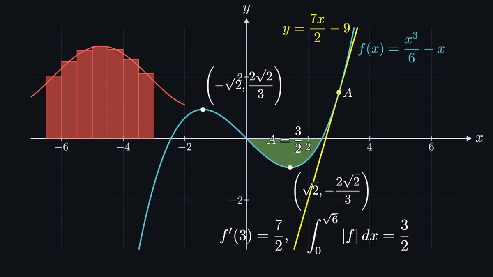
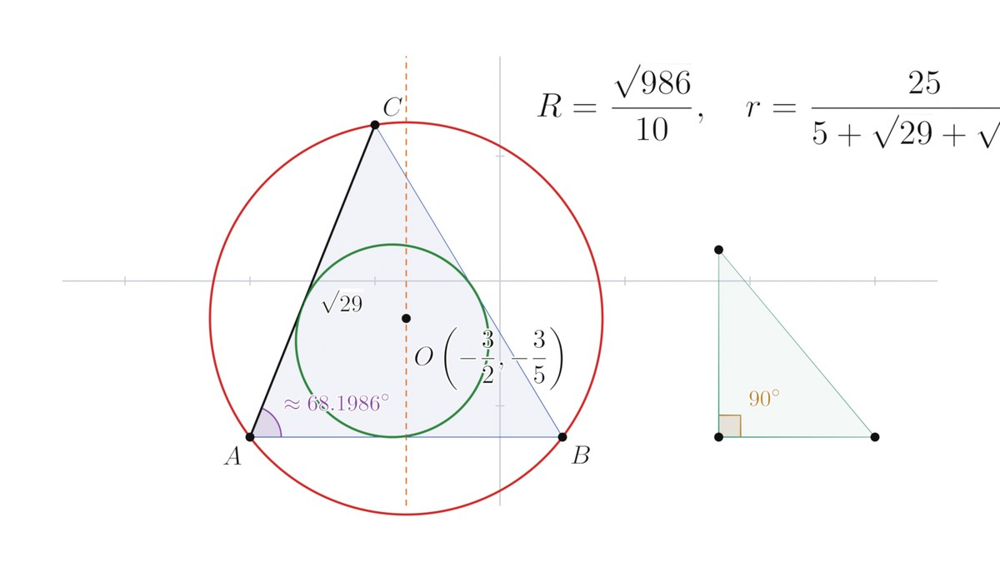
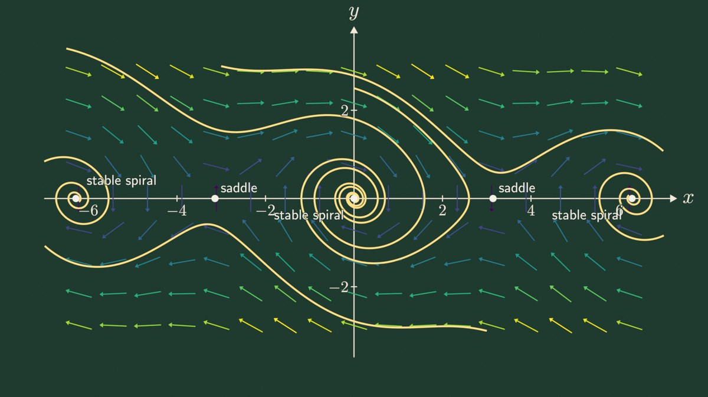
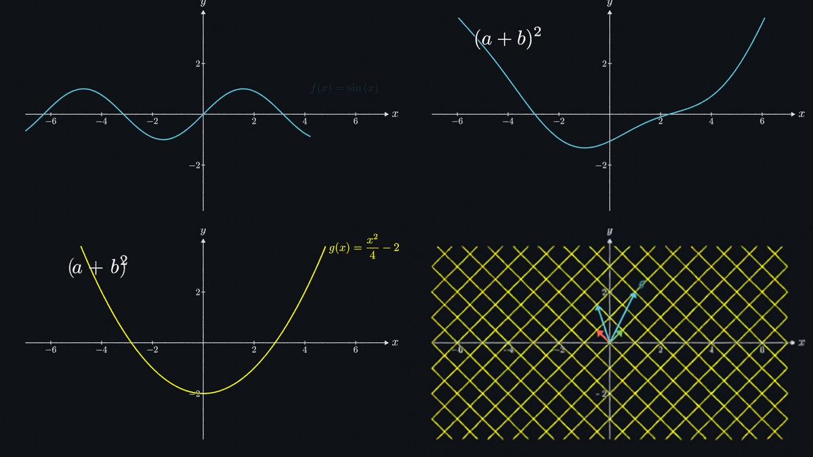

# Blender Math MCP

An [MCP](https://modelcontextprotocol.io) server plus Blender add-on that lets an AI build **mathematically exact** scenes in Blender. The math is organised as a **dependency graph**: functions, points, tangents, areas, circles and labels that know what they depend on. The output can be stills or animated videos.



| Geometry (light theme) | Phase portrait (chalkboard theme) |
|---|---|
|  |  |
| **3D surfaces** | **Typesetting & verified derivations** |
|  |  |

Animation frames (curve draw-on, exact function morph, equation morph, matrix transformation):



## What "correct" means here

**Nothing wrong is ever drawn.** Invalid requests are refused with the reason, and nothing changes:

- a tangent at the corner of `|x|`, the cusp of `x^(1/3)` or a pole
- an intersection index that doesn't exist
- a derivation with a false step (a counterexample is returned)
- a Riemann sum across a singularity
- a circle through three collinear points
- eigenvector lines of a rotation
- a graph update that would invalidate a dependent object

**Exact values.**
- Roots, extrema, inflection points and intersections are solved with SymPy and every solution is checked by substitution. Missing solutions are searched for with certified 50-digit numerics: a sign change proves a root exists, and poles are rejected.
- Closed forms are accepted only when proved (e.g. `-2π`, `√2/2`). Anything numeric-only is labelled `exact: false` with the method used.
- Geometry uses `sympy.geometry`: circumcircles, incircles, bisectors and intersections are exact.

**Exact drawing.**
- Curves are Bézier splines whose tangents come from the true derivative, accurate to 2% of the line width. Polynomial pieces of degree ≤ 3 (interpolating splines, cubics, B-spline spans, Béziers) are drawn exactly, because a cubic Bézier is a cubic.
- Long segments are split exactly (de Casteljau), so Blender's tessellation stays smooth.
- Poles and jumps break the curve, undefined regions stay empty, and clipping happens at the exact crossing point.
- Fills are clipped to the view, never clamped.

**Exact motion.**
- Function morphs are the pointwise blend `(1−s)·f + s·g` at every frame.
- Matrix animations pass through exact intermediate maps `(1−s)I + sA`.
- Equation morphs move matching glyphs.

**Exact colors.** The 'Standard' view transform and unlit materials show `#58C4DD` as exactly `#58C4DD`.

**Real typesetting.** Formulas are LaTeX (or matplotlib mathtext as a fallback) turned into actual font outlines. LaTeX runs at its 10pt design size, so fixed lengths such as matrix column spacing are right.

## The dependency graph

```text
a = 1/6                               set_parameter('a', '1/6')
f(x) = a·x³ − x                       define_function('f', 'a*x^3 - x', label=True)
A = point on f at x = 3               add_point('A', on='f', x='3')
t = tangent to f at A                 add_calculus('tangent', function='f', point='A', label=True)
S = area under f on [0, √6]           add_calculus('area', upper='f', a='0', b='sqrt(6)', label=True)
"f'(3) = \val{f'(A_x)}"               add_text("f'(3) = \\val{f'(A_x)}", at=[4, -3])
```

`set_parameter('a', '1/4')` recomputes f, A, t, S and the text, and the text updates to show the new value. Updates are transactional: if any dependent would become invalid, the change is rejected and the reason is returned.

In expressions you can use:
- parameters: `a`
- functions and derivatives: `f(x)`, `f'(x)`, `f''(2)`
- point and vector coordinates: `A_x`, `A_y`
- scalar results by name: segment lengths, angles, areas, Riemann sums, circle radii `c1_r`

The graph is stored in the `.blend` file, so it survives restarts.

**Where the center is:** the default axes put the math origin (0, 0) at Blender's world origin, with 1 math unit = 1 Blender unit. The 2D view shows x ∈ [−8, 8] and y ∈ [−4.5, 4.5]. `get_bounds`, `align_object` and `frame_view(center_on='origin' | 'content')` handle layout. Labels are placed automatically where they don't collide with curves or other labels, and are re-laid out after every change.

## Tools

| Area | Tools |
|---|---|
| Graph | `list_objects`, `get_object`, `update_object`, `delete_object`, `clear_scene`, `set_parameter` |
| Functions & points | `create_axes`, `define_function`, `add_point` (coords / on a graph or circle / intersection / root / extremum / inflection / midpoint / center), `find_points` (all roots, extrema, inflections or intersections, exact) |
| Calculus | `add_calculus`: tangent, normal, secant, riemann_sum (left/right/midpoint/trapezoid/upper/lower; exact sum vs exact integral), area (geometric and signed), taylor, derivative, antiderivative, asymptotes |
| Geometry | `add_geometry`: segment, line (through points, point-slope, equation, perpendicular, parallel, perpendicular/angle bisector), ray, circle (center+radius, through 3 points, incircle), polygon, angle (right-angle marks) |
| Linear algebra | `add_linear_algebra`: vector, matrix_transform (grid, î/ĵ, images, determinant, eigenvalues), eigenvectors |
| Fields & ODEs | `add_field`: vector_field, slope_field, ode_solution (exact `dsolve`, verified, on its interval of existence; otherwise Dormand–Prince 5(4) at rtol 1e-10 with blow-up detection), phase_portrait (all equilibria found and classified), complex_map |
| Curves & surfaces | `plot_curve` (parametric, polar, implicit), `plot_surface` (graph with colormap and iso-lines, parametric with welded seams) |
| Splines | `add_spline`: interpolate (natural / clamped / not-a-knot / periodic / Lagrange, with exact piecewise formula), bezier (any degree, de Casteljau construction at t), bspline, bspline_basis |
| Text | `add_text` (LaTeX with live `\val{…}` values), `add_derivation` (verified steps, aligned `=`), `expression_to_latex` |
| Math only | `verify_math`, `compute` (simplify, diff, integrate, limit, series, solve, sum, …) |
| Scene | `setup_scene` (2D/3D, theme `dark`/`light`/`chalkboard`), `frame_view`, `get_bounds`, `align_object`, `render_preview` (returns an image so the AI can check its work), `blender_status`, `execute_blender_code` (off by default) |
| Animation | `animate`: create (draw-on), write (handwriting), fade_in/out, grow, indicate, transform (function / equation / curve morphs), apply_matrix, camera_move, camera_orbit, wait. Plus `set_timeline` and `render_video` (MP4/H.264 or PNG sequence). Animations are replayed automatically when the graph changes. |

## Installation

### 1. MCP server (Python ≥ 3.10)

```bash
pip install git+https://github.com/GTKottman/Blender-Math      # or: pip install -e .
```

The command is `blender-math-mcp`. You can also run it without installing:

```bash
uvx --from git+https://github.com/GTKottman/Blender-Math blender-math-mcp
```

**Recommended: install LaTeX** for full LaTeX (matrices, `cases`, `aligned`, `\text`), for example TeX Live, MiKTeX or MacTeX with `latex` and `kpsewhich` on your PATH. On Debian/Ubuntu:

```bash
sudo apt install texlive-latex-base texlive-latex-extra texlive-fonts-recommended cm-super
```

Without LaTeX, matplotlib's mathtext (same Computer Modern fonts, TeX subset) is used. Check which one is active with `blender_status`.

### 2. Blender add-on (Blender 4.2 LTS or newer; tested on 4.2 and 4.5 LTS)

```bash
python scripts/build_addon.py      # -> dist/blender_math_bridge.zip
```

In Blender:
1. *Edit → Preferences → Add-ons → Install from Disk…* and pick the zip.
2. Enable **Blender Math Bridge (MCP)**.
3. In the 3D View press **N**, open the **Math MCP** tab and click **Start Math MCP server**. Auto-start is available in the add-on preferences.

### 3. Connect your AI client

**Claude Code:**

```bash
claude mcp add blender-math -- blender-math-mcp
```

**Claude Desktop** (`claude_desktop_config.json`):

```json
{ "mcpServers": { "blender-math": { "command": "blender-math-mcp" } } }
```

Environment variables:
- `BLENDER_MATH_HOST`, `BLENDER_MATH_PORT` (default `127.0.0.1:9877`)
- `BLENDER_MATH_BACKEND` (`auto` | `latex` | `mathtext`)
- `BLENDER_MATH_THEME` (`dark` | `light` | `chalkboard`)

To check the setup without an AI, run `python examples/showcase.py` while the Blender server is running.

## Example prompts

- *"Graph f(x) = x³/6 − x with its extrema labelled exactly, the tangent at x = 3, and the area between f and the x-axis on [0, √6]. Then animate: axes, draw f, show the tangent, write the area value."*
- *"Show a triangle with its circumcircle, incircle and exact circumradius. Mark the right angle if there is one."*
- *"Animate the shear [[1,1],[0,1]] acting on the plane and on v = (1, 2), then show the eigenvector lines of [[2,1],[1,2]]."*
- *"Phase portrait of the damped pendulum x' = y, y' = −sin x − 0.3y with its equilibria classified, on a chalkboard theme."*
- *"Morph sin x into x²/4 − 2, then transform the equation (a+b)² into a² + 2ab + b²."*

## Development

```bash
pip install -e ".[test]"
pip install "bpy==4.2.0"     # optional: runs the real add-on headless for end-to-end tests (Python 3.11)
pytest                       # 111 tests: math, splines, key points, graph semantics, drawing, animation, protocol
```

```text
src/blender_math_mcp/
  server.py          MCP tools (MCP SDK 1.x FastMCP or 2.x MCPServer)
  studio.py          facade: graph + scene + layout + animation (usable without MCP)
  construction.py    dependency graph engine (transactional updates, persistence)
  kinds_*.py         object kinds: core, calculus, geometry, linalg, fields, splines
  keypoints.py       exact roots / extrema / intersections / equilibria; refusals
  splines.py         Hermite Bezier fitting, exact subdivision, interpolation, Bezier/B-spline math
  sampling.py        adaptive sampling, discontinuities, exact clipping, implicit curves, surfaces
  typeset.py         LaTeX / mathtext -> glyph outlines (per glyph, for morphs)
  render.py          Blender primitives, 2D layering, label placement and relayout
  animation.py       timeline, draw/write/fade/morph/matrix/camera animations
  fields.py          ODEs (dsolve, Dormand-Prince), eigen helpers
  themes.py, geometry.py, expressions.py, blender_client.py
blender_addon/blender_math_bridge/   the Blender add-on (single file + manifest)
```

## Security

The add-on listens only on `127.0.0.1`. Expressions are parsed in a restricted SymPy namespace with no attribute access, imports or statements. Arbitrary Python execution in Blender is off by default.
